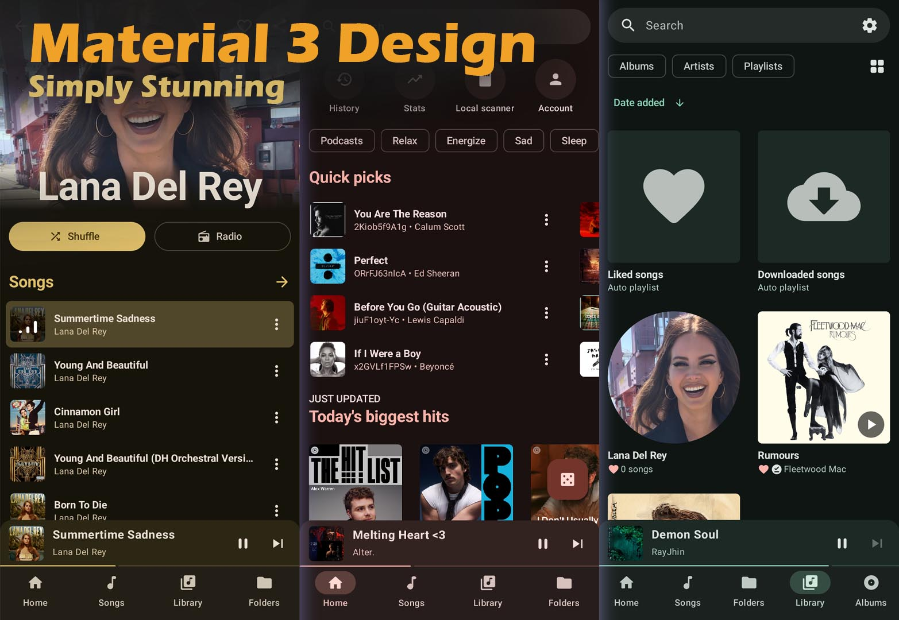
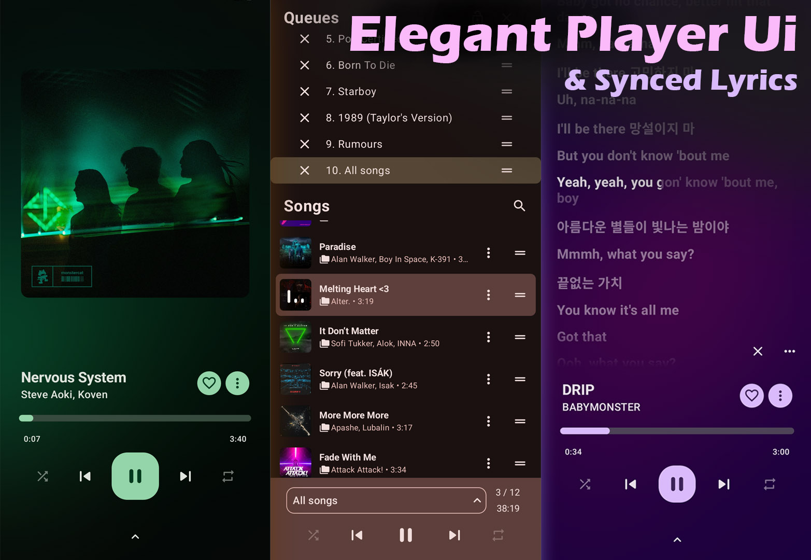

<div align="center">
  
  <h1>OpenTune</h1>
  <p>A free, open-source Android music player powered by YouTube Music and yt-dlp.</p>
</div>

---

## What is OpenTune?

OpenTune streams music directly from YouTube Music — no account required. It uses the YouTube ANDROID player API as the primary stream resolver, with yt-dlp as an automatic fallback for geo-restricted or login-required content.

## Stream Architecture

```
Search / Share URL
       ↓
  Tap to play
       ↓
  StreamResolver
   ├─ 1. In-memory cache (5h TTL)
   ├─ 2. YouTube ANDROID player API  ← primary, no binary needed
   └─ 3. yt-dlp binary (auto-updated) ← fallback
       ↓
    ExoPlayer
```

yt-dlp is downloaded automatically from the [official GitHub releases](https://github.com/yt-dlp/yt-dlp/releases) and updated every 24 hours in the background.

## Main Features

- **Search** YouTube Music by song, artist, or album
- **Home recommendations** from YouTube Music
- **Playback** with ExoPlayer — background play, notification controls
- **yt-dlp fallback** for geo-restricted tracks
- **Auto-update** yt-dlp binary via WorkManager (daily, on Wi-Fi)
- **Local library** — scan and play music already on your device
- **Queue management** — shuffle, repeat, reorder
- **Share** a YouTube/YouTube Music URL to play it directly in OpenTune

## Screenshots

| Home | Player |
|------|--------|
|  |  |

## Building

1. Clone the repo  
   ```bash
   git clone https://github.com/Tigerskin-Hupee/OpenTune.git
   ```
2. Open in Android Studio (Hedgehog or newer)
3. Build & run on a device or emulator (API 26+)

No API keys or accounts are required.

## Based on

[OuterTune](https://github.com/DD3Boh/OuterTune) — GPL-3.0
